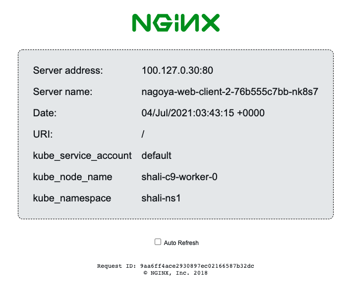

# NGINX server which shows hostname, IP address, port, and k8s other variables

How to run:
```
$ docker run -p 8080:80 --name web-client risyou/k8s-web-client
```

Running with docker will gives you same result as it's origin image - https://github.com/nginxinc/NGINX-Demos/tree/master/nginx-hello

# Expose k8s running environment
You can expose k8s metadata into environment variable, if the name start with kube_, it will shows up like this



Example

```
kind: Deployment
apiVersion: apps/v1
metadata:
  name: web-client
spec:
  replicas: 2
  selector:
    matchLabels:
      app: web-client
  template:
    metadata:
      labels:
        app: web-client
    spec:
      containers:
        - name: web-client
          image: risyou/k8s-web-client
          ports:
            - containerPort: 80
          env:
          - name: kube_namespace
            valueFrom:
              fieldRef:
                fieldPath: metadata.namespace
          - name: kube_service_account
            valueFrom:
              fieldRef:
                fieldPath: spec.serviceAccountName
          - name: kube_node_name
            valueFrom:
              fieldRef:
                fieldPath: spec.nodeName

```

More information about downward API can be find here - https://kubernetes.io/docs/tasks/inject-data-application/downward-api-volume-expose-pod-information/
